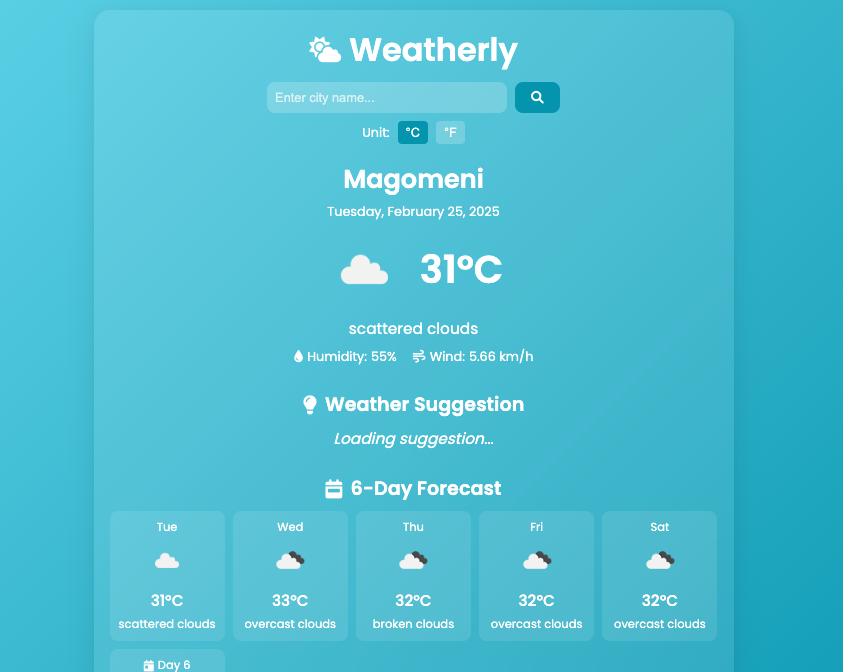

# Weatherly - Your Weather Companion

A sleek and responsive weather application that provides current weather conditions and 6-day forecasts for any city worldwide.

## Features

- Real-time weather data using OpenWeather API
- Current weather conditions including temperature, humidity, and wind speed
- 6-day weather forecast
- Temperature unit conversion (Celsius/Fahrenheit)
- Weather-based suggestions
- Dynamic backgrounds based on weather conditions
- Automatic location detection
- Mobile-responsive design

## Technologies Used

- HTML5
- CSS3
- JavaScript (ES6+)
- OpenWeather API
- Font Awesome Icons
- Google Fonts

## Setup

1. Clone this repository
2. Get an API key from [OpenWeather](https://openweathermap.org/api)
3. Replace `API_KEY` in `script.js` with your OpenWeather API key
4. Open `index.html` in your browser

## Credits

- Weather data provided by [OpenWeather API](https://openweathermap.org/api)
- Created by Ocdeed Codes
- © 2024 All rights reserved

## Screenshot

